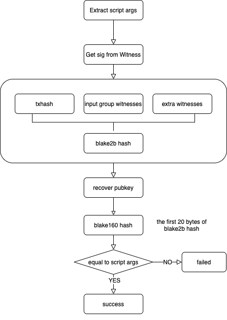
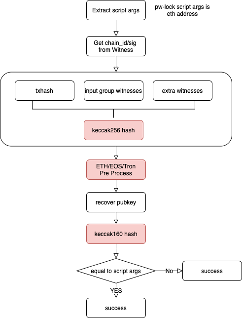

# PW-Lock 在 CKB 上的实现

由于 CKB 脚本的灵活性，能支持各种自定义的脚本。 [Lay2 团队](https://twitter.com/Lay2dev)开发了一套能够验证 ETH/EOS/TRON 生态钱包签名以及浏览器基于 Webauthn 签名的锁定脚本，并将其命名为 pw-lock。

## 快速开始

```bash
git submodule init
git submodule update
make install-tools
make all-via-docker
CHAIN_ID=1 cargo test --all   # Ethereum signature test
CHAIN_ID=2 cargo test --all   # EOS signature test
CHAIN_ID=3 cargo test --all   # TRON signature test
```

## 实现原理

### CKB 官方锁定脚本原理

官方锁定脚本 [**secp256k1_blake160_sighash_all**](https://github.com/nervosnetwork/ckb-system-scripts/blob/master/c/secp256k1_blake160_sighash_all.c) 采用了 secp256k1_ecdsa_recover 签名和 blake160 的 hash 算法来完成交易的签名验证，具体的验证流程如下所示：



1. 提取脚本参数 lock_args；
2. 从交易 witness 中提取签名 signature；
3. 通过 blake2b hash 算法计算交易的 message_digest；
4. 根据 message_digest 和 signature 调用 secp256k1_ecdsa_recover 恢复出 public key；
5. 对 public key 进行 blake160 hash，并与 lock_args 进行比较。如果相等则通过签名验证。

### PW-Lock 脚本分类

PW-Lock 脚本参考了 CKB 官方锁定脚本的实现，替换了相关的 hash 算法和签名算法。PW-Lock 基于场景的考虑，分别实现了针对 secp256k1 算法和 secp256r1 算法在 CKB 链上的验证。

#### 1. Secp256k1 系列

由于 Ethereum/EOS/TRON 各条公链钱包均支持自定义消息签名，并且对传入的自定义消息进行处理后，才调用钱包 private key 进行 Secp256k1 算法签名。由于三条公链钱包均支持自定义消息签名，签名流程也基本相同，因此我们将 3 条链在 CKB 上的验签逻辑集中到一个脚本中 [secp256k1_keccak256_sighash_all.c](https://github.com/lay2dev/pw-lock/blob/develop/c/secp256k1_keccak256_sighash_all.c)。



脚本实现流程如下：

1. 提取脚本参数 lock_args，lock_args 统一采用 public key 的 keccak256 hash 的后 20 个字节（即[ETH地址的生成规则](https://hackernoon.com/how-to-generate-ethereum-addresses-technical-address-generation-explanation-25r3zqo))；
2. 从交易 witness 中提取链标识 chain_id 和签名 signature，通过 witness.lock 的第 1 个 byte 来标识不同的链（1 = ETH, 2 = EOS, 3 = TRON)，剩下的 65byte 表示 recoverable 的 signature；
3. 计算交易的 message_digest，hash 算法采用 keccak256；
4. 基于不同链对 message_digest 做相应适配处理，得到 wrapped_message_digest；
5. 根据 wrapped_message_digest 和 signature 调用 secp256k1_ecdsa_recover 恢复出 public key；
6. 对 public key 进行 keccak256hash，取后 20 个字节与 lock_args 进行比较。如果相等则通过签名验证。

wrapped_message_digest 是基于 message_digest 获得，为了适配不同的链采用各条链上支持的自定义消息签名方法的预处理逻辑进行处理后得

- Ethereum 上支持两种自定义消息签名：[eth_personalSign](https://github.com/MetaMask/eth-sig-util#personalsign-privatekeybuffer-msgparams) 和 [eth_signTypedData_v4](https://docs.metamask.io/guide/signing-data.html#sign-typed-data-v4)，对应的[预处理方式](./docs_cn/Ethereum.md) 。

- EOS 上支持的自定义消息签名为 [scatter.getArbitrarySignature()](https://get-scatter.com/developers/api/requestarbitrarysignature)，对应的[预处理方式](./docs_cn/EOS.md) 。

- TRON上支持的自定义消息签名为 [tronweb.trx.sign()](https://developers.tron.network/docs/tronlink-integration#signature)，对应的[预处理方式](./docs_cn/TRON.md) 。

#### 支持 Anyone-can-pay

Secp256k1 系列脚本也集成了 anyone-can-pay 的特性，与官方发布的 [anyone-can-pay](https://github.com/nervosnetwork/ckb-anyone-can-pay) 一致。实现脚本为 [secp256k1_keccak256_sighash_all_acpl.c](https://github.com/lay2dev/pw-lock/blob/develop/c/secp256k1_keccak256_sighash_all_acpl.c) 。

#### 2. Secp256r1 系列 -- Webauthn

由于 ES256/sha256 算法得到了大多数硬件设备的支持，Lay2 团队在 CKB 上实现了该算法的验证签名逻辑 [secp256r1_sha256_sighash.c](https://github.com/lay2dev/pw-lock/blob/develop/c/secp256r1_sha256_sighash.c)。并采用了 [libecc](https://github.com/ANSSI-FR/libecc) 库提供的 secp256r1 验证签名支持，Lay2 团队在将该库迁移到 CKB 的过程中做了相应的[优化](https://github.com/lay2dev/libecc.gi)。

参考 webauthn 授权验证的相关[示例](https://webauthn.guide/#authentication)，在签名前传入 challenge 为可变随机值，签名后得到的结果中包含 clientDataJSON 和 authenticatorData 辅助签名验证。

Webauthn 浏览器调用签名脚本示例：

```javascript
const publicKeyCredentialRequestOptions = {
    challenge: Uint8Array.from(
        randomStringFromServer, c => c.charCodeAt(0)),
    allowCredentials: [{
        id: Uint8Array.from(
            credentialId, c => c.charCodeAt(0)),
        type: 'public-key',
        transports: ['usb', 'ble', 'nfc'],
    }],
    timeout: 60000,
}

const assertion = await navigator.credentials.get({
    publicKey: publicKeyCredentialRequestOptions
});
```

Webauthn 授权返回结果示例：

```javascript
console.log(assertion);

PublicKeyCredential {
    id: 'ADSUllKQmbqdGtpu4sjseh4cg2TxSvrbcHDTBsv4NSSX9...',
    rawId: ArrayBuffer(59),
    response: AuthenticatorAssertionResponse {
        authenticatorData: ArrayBuffer(191),
        clientDataJSON: ArrayBuffer(118),
        signature: ArrayBuffer(70),
        userHandle: ArrayBuffer(10),
    },
    type: 'public-key'
}
```

clientDataJSON示例：

```javascript
 {
   "type": "webauthn.get",
   "challenge": "S1TsVwxDkO4ZbNa2EJvywNWS9prOay0x_uCTIv4cHs4",
   "origin": "https://r1-demo.ckb.pw",
   "crossOrigin": false
 }
```

[Webauthn签名过程](https://w3c.github.io/webauthn/#fig-signature)

```javascript
// 伪代码
const client_data_hash = sha256(client_data_json);
const message_digest = sha256(authr_data + client_data_hash);
const signature = secp256r1_sign(message_digest, private_key);
```

基于 webauthn 的特有签名逻辑，验证 webauthn 签名的 CKB 脚本基本流程如下：

1. 提取脚本参数 lock_args。lock_args 采用 public key 的 sha256 hash 的前 20 个字节；
2. 从交易 witness 中提取签名等相关信息 public key/signature/authr_data/client_data；
3. **验证 **public key 的 sha256 hash 的前 20 个字节是否与 lock_args 相等；
4. 计算交易的 message_digest，hash 算法采用 sha256；
5. **验证** message_digest 是否作为 challenge 存在于 client_data 中;
6. 基于 authr_data/client_data 与 public key 和 signature，调用 libecc **验证**签名是否为有效签名。
